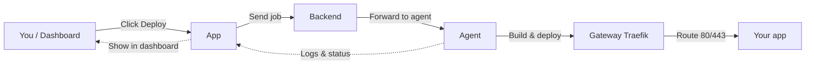

<div align="center">
  
</div>

<div align="center">
  <h1>PodFire</h1>
  <p><strong>Deployment from source code management to production.</strong></p>
</div>

<p align="center">
  
  
  
  
</p>

<p align="center">
  PodFire is a deployment platform that runs your repositories as Dockerized applications. Connect your repository, use one dashboard for builds and routing, and deploy without configuration overhead. Self-hosted option available.
</p>

---

## Features

| Feature | Description |
|--------|-------------|
| **Dashboard** | Manage services, trigger deployments, and view logs in one place. |
| **Deploy agents** | Deploy repositories as Docker stacks automatically. |
| **Service management** | Define services from your repository with optional env vars and config. |
| **Live logs** | Monitor deployments and service status in real time. |
| **Auto-deploy** | Optionally deploy on new commits. |

---

## Project structure

```
podfire/
├── app/                 # Web dashboard and management interface
├── agent/               # Deploy agents
├── docs/                # Documentation and marketing site
├── README.md
├── DEVELOPER_GUIDE.md   # Setup and development instructions
├── IMPROVEMENTS.md      # Roadmap and improvement tasks
└── .gitignore
```

---

## Prerequisites

- **Docker** and **Docker Swarm** (initialized)
- Network configuration for deployed services

---

## Quick start

1. Set up the dashboard and configure environment variables.
2. Run deploy agents and connect them to the dashboard.
3. Link a repository, define a service, and deploy.
4. Monitor deployments and logs from the dashboard.

For detailed setup and troubleshooting, see **[DEVELOPER_GUIDE.md](./DEVELOPER_GUIDE.md)**.

---

## Deployment workflow

When you deploy an app, the request goes through the app, backend, and agent. The **Gateway (Traefik)** handles HTTP/HTTPS (80/443) and routes traffic to your deployed apps.



| Step | What happens |
|------|----------------|
| 1 | You click **Deploy** in the dashboard (or auto-deploy runs on a schedule). |
| 2 | The **App** checks that an agent is connected, then sends the deploy job to the **Backend**. |
| 3 | The **Backend** forwards the job to a connected **Agent**. |
| 4 | The **Agent** clones your repo, builds the image, and deploys the stack. The **Gateway (Traefik)** routes HTTP/HTTPS traffic to your app. |
| 5 | Logs and status stream back to the dashboard so you can see progress. |

---

## License

This project is source-available and free for personal, educational, and non-commercial use.

Commercial use (including use by companies, organizations, startups, SaaS, or revenue-generating services) requires prior written permission.
